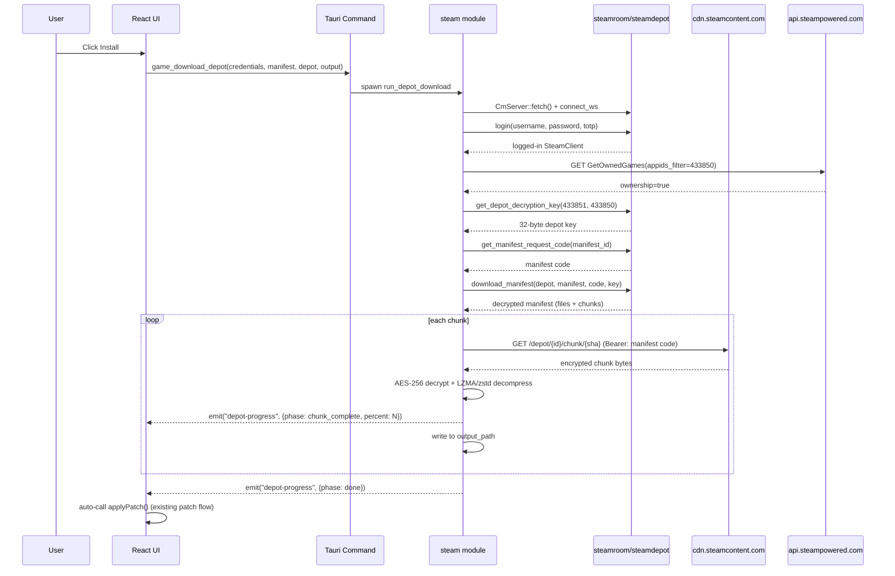

# Integrate `steamroom` for self-contained Steam depot downloads

## Goal

Replace the stub `download_steam_depot` (currently just opens `steam://open/console`) with a real downloader that:
- Logs in to Steam via mobile credentials (no Steamworks SDK, no partner account, no Steam client running)
- Verifies ownership of H1Z1 (`IPlayerService/GetOwnedGames`)
- Fetches the encrypted manifest + depot decryption key via CM (encrypted session over WebSocket)
- Downloads chunks from `cdn.steamcontent.com` with HTTP/2 multiplexing
- Decrypts (AES-256) and decompresses (Valve LZMA / zstd / zip) chunks
- Reassembles files into the user's chosen directory
- Streams progress to the React UI via a new `depot-progress` event
- Auto-triggers the existing patch flow on success

## Architectural Decisions

- **Crate**: `steamroom = "0.3"` (MIT/Apache-2.0 — closed-source friendly). `steamdepot` was rejected because its LGPL-2.1 license would force source disclosure with static linking.
- **Auth**: Prompt Steam credentials separately in the launcher UI; persist the `access_token` + `refresh_token` in the local `launcher_config.json` alongside the Zemu session. Do not reuse the Zemu bearer token — Steam CM needs its own session.
- **Progress channel**: New `depot-progress` event (does not interfere with the existing `update-progress` channel used by `downloadUpdate` for the patch).
- **Patch follow-up**: Auto-trigger `applyPatch()` once `depot-progress` reports `phase: "done"`.

## Files Touched

| Layer | File | Purpose |
|---|---|---|
| Backend | [src-tauri/Cargo.toml](src-tauri/Cargo.toml) | Add `steamroom = "0.3"` |
| Backend | [src-tauri/src/lib.rs](src-tauri/src/lib.rs) | Add `mod steam;` |
| Backend | [src-tauri/src/storage.rs](src-tauri/src/storage.rs) | Persist Steam credentials / tokens |
| Backend | [src-tauri/src/models.rs](src-tauri/src/models.rs) | New `DepotProgress`, `SteamCredentials`, `CommandResult` reuse |
| Backend | [src-tauri/src/commands.rs](src-tauri/src/commands.rs) | Replace `game_download_depot` body; add new commands |
| Backend | [src-tauri/src/game.rs](src-tauri/src/game.rs) | Replace `download_steam_depot` stub with `steamroom` pipeline |
| Backend | [src-tauri/src/steam/mod.rs](src-tauri/src/steam/mod.rs) | **NEW** — orchestrator (init, login, ownership, download) |
| Backend | [src-tauri/src/steam/auth.rs](src-tauri/src/steam/auth.rs) | **NEW** — mobile credentials → refresh token |
| Backend | [src-tauri/src/steam/ownership.rs](src-tauri/src/steam/ownership.rs) | **NEW** — `IPlayerService/GetOwnedGames` ownership check |
| Backend | [src-tauri/src/steam/download.rs](src-tauri/src/steam/download.rs) | **NEW** — manifest fetch + chunk download + reassemble |
| Frontend | [src/lib/tauri-bridge.ts](src/lib/tauri-bridge.ts) | Replace `gameAPI.downloadDepot`; add `onDepotProgress` |
| Frontend | [src/hooks/use-game-state.ts](src/hooks/use-game-state.ts) | New `steamCredentials` state + auto-apply patch; subscribe to `depot-progress` |
| Frontend | [src/components/...](src/components/) | New `SteamLoginDialog` component (or reuse existing auth dialog pattern) |

## Step-by-Step Plan

### Phase 1 — Backend skeleton

1. In [src-tauri/Cargo.toml](src-tauri/Cargo.toml) add:

```toml
steamroom = "0.3"
tokio = { version = "1", features = ["full"] }
```

(`steamroom` already pulls in `tokio-tungstenite`, `reqwest`, `aes`, etc. — verified from its [crates.io dep list](https://crates.io/crates/steamroom).)

2. In [src-tauri/src/lib.rs](src-tauri/src/lib.rs) add `mod steam;` and re-export a `steam::download_depot` entry point.

3. In [src-tauri/src/steam/mod.rs](src-tauri/src/steam/mod.rs) define the orchestrator signature:

```rust
pub struct DepotRequest {
    pub app_id: u32,          // 433850 (H1Z1)
    pub depot_id: u32,        // 433851
    pub manifest_id: u64,     // 6098349229565958949
    pub output_dir: PathBuf,
    pub app: AppHandle,
}

pub async fn run_depot_download(req: DepotRequest) -> Result<()>;
```

### Phase 2 — Auth

1. In [src-tauri/src/steam/auth.rs](src-tauri/src/steam/auth.rs) implement:

```rust
use steamroom::client::SteamClient;
use steamroom::transport::websocket::WebSocketTransport;
use steamroom::connection::{CmServer, Protocol};

pub async fn login_credentials(
    username: &str,
    password: &str,
    totp: Option<&str>,
) -> Result<(SteamClient, _rx)>;  // returns live CM client + event receiver
```

Pull CM servers with `CmServer::fetch().await?`, pick a WebSocket endpoint, connect via `WebSocketTransport::connect`. Call `client.login(username, password)` with the Steam Guard code if `totp` is `Some`.

2. Persist tokens: extend [src-tauri/src/storage.rs](src-tauri/src/storage.rs) with:

```rust
pub struct SteamCredentials {
    pub username: String,
    pub access_token: String,
    pub refresh_token: String,
}
```

Save/load alongside the existing `launcher_config.json`. Tokens survive restarts; we call `client.login_with_refresh_token` instead of prompting again.

### Phase 3 — Ownership

1. In [src-tauri/src/steam/ownership.rs](src-tauri/src/steam/ownership.rs) call:

```
GET https://api.steampowered.com/IPlayerService/GetOwnedGames/v1/
    ?steamid={steam_id}
    &include_appinfo=1
    &appids_filter[0]=433850
    &access_token={access_token}
```

Return `Result<bool>` — `true` if the user owns H1Z1. SteamGuard is not required for Web API calls once logged in (the access token carries the session).

2. Frontend command: if not owned, emit a `depot-progress` event with `phase: "blocked"` and `reason: "no_ownership"`. Frontend shows a "Buy H1Z1 on Steam" prompt.

### Phase 4 — Manifest + chunk download

1. In [src-tauri/src/steam/download.rs](src-tauri/src/steam/download.rs) the pipeline:

```rust
let key = client.get_depot_decryption_key(DepotId(req.depot_id), AppId(req.app_id)).await?;
let manifest_code = client.get_manifest_request_code(...).await?;
let manifest = client.download_manifest(req.depot_id, req.manifest_id, &manifest_code, &key).await?;

for file in manifest.files() {
    emit_progress("file_started", file.filename());
    let mut out = tokio::fs::File::create(req.output_dir.join(&file.filename())).await?;
    for chunk in file.chunks() {
        let bytes = client.download_chunk(...).await?;
        let plaintext = steamroom::depot::chunk::decrypt(&bytes, &key)?;
        let decompressed = steamroom::depot::chunk::decompress(&plaintext)?;
        out.write_all(&decompressed).await?;
        emit_progress("chunk_complete", (bytes_downloaded, bytes_total));
    }
    emit_progress("file_complete", file.filename());
}
emit_progress("done", "");
```

Progress events are sent via `app.emit("depot-progress", payload)` from inside the loop — matches the existing `update-progress` pattern in `update.rs`.

### Phase 5 — Replace stub command

In [src-tauri/src/game.rs](src-tauri/src/game.rs), replace `download_steam_depot` with a thin wrapper that spawns a Tokio task:

```rust
pub fn download_steam_depot(
    app: &AppHandle,
    credentials: SteamCredentials,
    request: DepotRequest,
) -> CommandResult {
    tokio::spawn(async move {
        if let Err(err) = steam::run_depot_download(request).await {
            app.emit("depot-progress", DepotProgress::err(err.to_string())).ok();
        }
    });
    CommandResult::ok()
}
```

In [src-tauri/src/commands.rs](src-tauri/src/commands.rs) change the `game_download_depot` signature to accept `SteamCredentials`:

```rust
#[tauri::command]
pub fn game_download_depot(
    app: tauri::AppHandle,
    credentials: SteamCredentials,
    manifest_id: String,
    depot_id: String,
    output_path: String,
) -> CommandResult
```

### Phase 6 — Frontend wiring

1. In [src/lib/tauri-bridge.ts](src/lib/tauri-bridge.ts):

```typescript
gameAPI.downloadDepot = (manifestId, depotId, outputPath, credentials) =>
  invoke<{ success: boolean; error?: string }>('game_download_depot', {
    manifestId, depotId, outputPath, credentials,
  });

gameAPI.onDepotProgress = (cb) =>
  listen<DepotProgress>('depot-progress', (e) => cb(e.payload));
```

2. In [src/hooks/use-game-state.ts](src/hooks/use-game-state.ts):
   - Track `steamCredentials` in state (load from a new `launcher_get_steam_credentials` command on mount).
   - Open `SteamLoginDialog` if no credentials when the user clicks install.
   - Subscribe to `depot-progress` events in a new `useEffect`; update `isDownloadingDepot`, expose `depotProgress` state.
   - When `depot-progress` emits `phase: "done"`, call `applyPatch()` automatically (decision locked).

3. New `SteamLoginDialog` component:
   - Username + Password + (optional TOTP) inputs.
   - Submit calls `gameAPI.downloadDepot(...)` with credentials.
   - Pops the dialog after submit; backend handles everything.

### Phase 7 — Cleanup

- Remove the `webbrowser::open("steam://...")` fallback from `game.rs` once `steamroom` flow is verified.
- Add an integration test that uses `steamroom-cli` against App ID `480` (Spacewar — Valve's free test app) as a smoke test for the login + download pipeline. This validates the flow without buying H1Z1.

## Sequence Diagram



## Out of Scope (Future Iterations)

- QR-code login (`steamroom` supports it, but a credentials dialog is sufficient for now)
- Multi-depot scripted download (`download_steam_depot` only handles one manifest at a time)
- Resume partially-downloaded depots (steamroom supports this via Adler-32 chunk checks)
- Storage caching of access tokens across machines (single-machine only for v1)

## Risks & Mitigations

| Risk | Mitigation |
|---|---|
| `steamroom` API breaks between 0.3 and later | Pin version in Cargo.toml; vendor a fork if upstream goes stale |
| Steam blocks the CM WebSocket fingerprint | Fallback to `CmServer::fetch` with TCP transport (steamroom supports both) |
| User is rate-limited by Steam CDN | Add a per-user `--max-concurrent` setting (default 8 from steamroom-client) |
| Manifest ID `6098349229565958949` goes stale when H1Z1 receives a depot update | Fetch latest manifest via `IPlayerService/GetOwnedGames` + `IPublishedFileService`; or hard-code a refresh strategy in the patch flow |

## Acceptance Criteria

- Running `cargo build` in `src-tauri` compiles cleanly with `steamroom = "0.3"` added.
- `npm run dev` boot does not regress.
- Clicking install opens `SteamLoginDialog` (no `steam://` URL opens in browser).
- After successful login + ownership check, real bytes land in the user-selected directory and the progress bar reflects them via `depot-progress`.
- On `phase: done`, the existing patch flow auto-starts.
- The `webbrowser::open("steam://...")` line is removed from `game.rs`.
