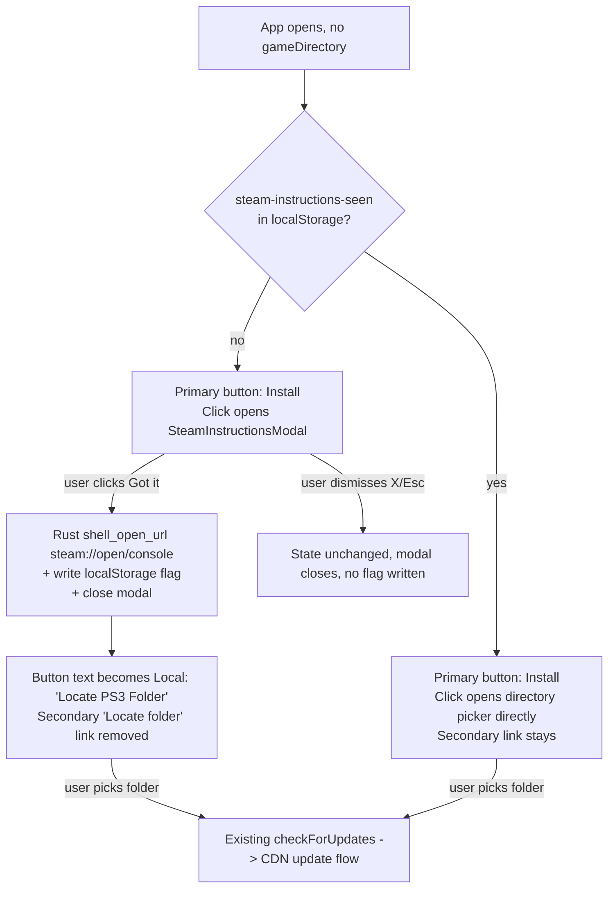

## Plan: Steam instructions modal before install

### Current state

- The primary `Install` button is rendered by `src/components/game-action-button.tsx` whenever `state.type === 'NEEDS_DESTINATION'` (i.e. no `gameDirectory` set in `useGameState`). Clicking it calls `selectDirectory()` directly.
- A smaller secondary link "Already installed? Locate folder" sits under the button and reuses the same handler.
- The Rust side already opens URLs via `webbrowser::open` (`src-tauri/src/auth.rs:307`), but there is no general-purpose `shell_open_url` command yet.

### Target state



### Files to change

1. **`src/components/steam-instructions-modal.tsx`** *(new)*
   - `Dialog` from `src/components/ui/dialog.tsx` (already supports the pattern via `DialogClose` and the `showCloseButton` flag — see `src/components/download-progress-dialog.tsx` for an example).
   - Title: "Download the base game" (or similar).
   - Body: numbered steps. Each command line uses a small inline `<button>` "Copy" next to it (uses `navigator.clipboard.writeText`, mirrors the shadcn `Button` `size="icon-sm" variant="ghost"`).
   - Footer: single primary button "Open Steam & continue" → calls `onAcknowledge()` then closes.
   - `onOpenChange` is wired to the dialog so X / Esc work as dismiss-without-flag.

2. **`src/lib/steam-instructions.ts`** *(new)* — tiny helper for the localStorage flag:
   - `STORAGE_KEY = 'zemu-launcher.steam-instructions-seen'`
   - `hasSeenSteamInstructions(): boolean`
   - `markSteamInstructionsSeen(): void`
   - `clearSteamInstructionsSeen(): void` (used by `clearDirectory` in `use-game-state.ts` so the modal reappears if the user wipes their install).

3. **`src-tauri/src/lib.rs` + `src-tauri/src/commands.rs`** *(or wherever commands are wired — likely the file that already exposes `auth_open_oauth`; check the existing `tauri::generate_handler!` block)*
   - Add a `shell_open_url` Tauri command:
     ```rust
     #[tauri::command]
     pub fn shell_open_url(url: String) -> Result<(), String> {
         webbrowser::open(&url).map_err(|e| e.to_string())
     }
     ```
   - Register it in the existing `#[tauri::command]` module / `generate_handler!` list. No new dependency — `webbrowser` is already a transitive dep (it's used in `auth.rs`).
   - The Tauri capabilities file (`src-tauri/capabilities/default.json` or similar) needs `shell_open_url` listed under `permissions` if capabilities are restrictive. Worth verifying — if it's currently `core:default` only, we'll need to add the custom command.

4. **`src/lib/tauri-bridge.ts`**
   - Extend `declare global { interface Window { ... } }` and `setupCompatibilityBridge()` to add `window.shellAPI.openUrl(url: string): Promise<void>` → `invoke<void>('shell_open_url', { url })`.
   - Mirror the pattern used for `window.gameAPI` / `window.authAPI` (lines 141 and 206).

5. **`src/components/game-action-button.tsx`**
   - Add local state `const [showSteamModal, setShowSteamModal] = useState(false)`.
   - On mount (useEffect once), read `hasSeenSteamInstructions()` to decide the initial button label — if not seen, button reads "Install" (unchanged) but routes through the modal first; if seen, behaves as today.
   - Rework `handlePrimaryAction`:
     - If `!hasSeenSteamInstructions()` and `state.type === 'NEEDS_DESTINATION'` → `setShowSteamModal(true)`, return.
     - Else if `state.type === 'NEEDS_DESTINATION'` → `await selectDirectory()` (current behaviour).
     - Else `UPDATE_AVAILABLE` → `startUpdate()` (unchanged).
   - Render `<SteamInstructionsModal open={showSteamModal} onOpenChange={setShowSteamModal} onAcknowledge={async () => { markSteamInstructionsSeen(); await window.shellAPI.openUrl('steam://open/console'); setButtonToLocateMode() }} />`.
   - When the user has seen instructions, the button label switches from `"Install"` to `"Locate PS3 Folder"` (via a `useState<boolean>` `hasLocated`) so the action matches the wording. Drop the existing "Already installed? Locate folder" sub-link once the user has acknowledged the modal — the primary button now covers both paths.
   - Note: `state.type === 'NEEDS_DESTINATION'` and button text override logic stays compatible — the only change is the source of the `BUTTON_TEXT` lookup for that one state.

6. **`src/hooks/use-game-state.ts`**
   - In `clearDirectory` (line 425), also call `clearSteamInstructionsSeen()` so a user who wipes their install sees the modal again. This matches the user's "re-show if they explicitly clear the folder / reinstall" answer.

### State / prop shape

```ts
// src/components/steam-instructions-modal.tsx
interface SteamInstructionsModalProps {
  open: boolean
  onOpenChange: (open: boolean) => void
  onAcknowledge: () => void | Promise<void>
}
```

```ts
// src/lib/steam-instructions.ts
export const STEAM_INSTRUCTIONS_STORAGE_KEY = 'zemu-launcher.steam-instructions-seen'
export function hasSeenSteamInstructions(): boolean { ... }
export function markSteamInstructionsSeen(): void { ... }
export function clearSteamInstructionsSeen(): void { ... }
```

### Content of the modal body

Numbered list rendered with the shadcn dialog typography, with a "Copy" button next to each command:

1. Open **Steam**.
2. Press **Win + R**, type `steam://open/console`, press **Enter**.
3. In the **Steam Console** window that opens, type:
   ```
   download_depot 433850 433851 6098349229565958949
   ```
   then press **Enter**.
4. Wait for the download to finish. The depot lands under `steamapps/content/app_433850/depot_433851/` — pick that folder on the next step.
5. Close Steam when done.

The `download_depot` line is the one command that benefits most from a Copy button.

### Why this approach

- Modal lives entirely in the renderer — no Rust state machine changes, no migrations, no risk of breaking the existing `NEEDS_DESTINATION` → `selectDirectory` path for already-installed users.
- "Open Steam" via a Tauri command matches the codebase's pattern for out-of-process URL handling (`auth_open_oauth` uses `webbrowser::open` directly on the Rust side). Using `window.open()` from the renderer would fail for `steam://` URLs in Tauri webview because the protocol handler isn't registered.
- localStorage flag keeps the modal out of the way after first run, but `clearSteamInstructionsSeen()` in `clearDirectory` re-arms it for users who uninstall — matches the user's "yes, only re-show on explicit clear" answer.
- The "Locate PS3 Folder" wording only appears after acknowledgement, so first-time users get instructions first while returning users get the faster path.

### Verification

1. Fresh launch (no folder, localStorage empty) → button reads "Install" → clicking opens the modal → clicking the footer button opens Steam (URL `steam://open/console` resolves on Windows/macOS/Linux via the `webbrowser` crate) and the button label updates to "Locate PS3 Folder".
2. Dismiss the modal with X/Esc → no flag written, modal reappears on next click of "Install".
3. After acknowledgement, click the now-"Locate PS3 Folder" button → directory picker opens → on confirm, the existing `selectDirectory` + `checkForUpdates` flow runs (no behaviour change).
4. Run `window.gameAPI.clearDirectory()` from devtools (or trigger the existing clear-directory code path) → next click of "Install" re-opens the modal.
5. Check the Rust logs for `webbrowser::open` invocation when the footer button is clicked.